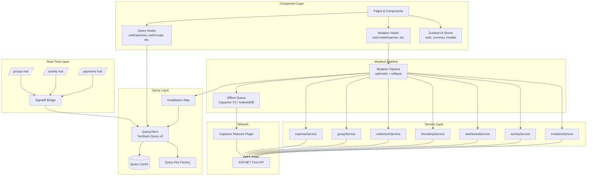
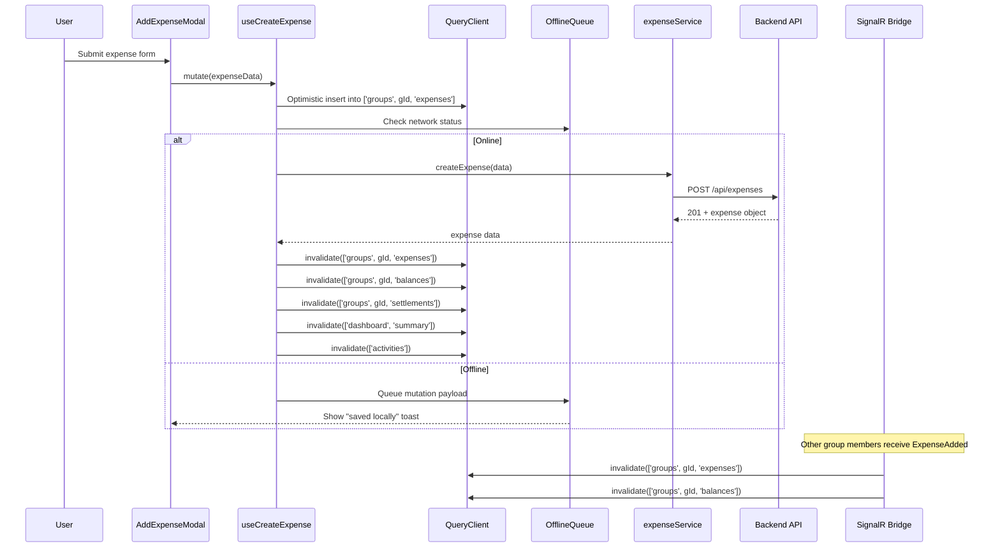
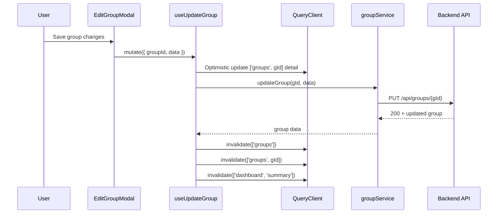
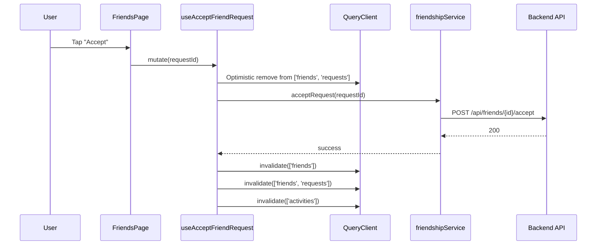

# Design Document: State Management Redesign

## Overview

This design replaces OnlySplit's fragmented Zustand-based server-state management with a unified TanStack Query layer, retaining Zustand only for transient UI state (modals, tabs, filters, form drafts, auth, currency). The architecture introduces deterministic mutation → invalidation chains, a centralized SignalR bridge for real-time cache updates, optimistic UI patterns with rollback, and an offline mutation queue for mobile resilience.

**Key Goals:**
- Eliminate stale state across all screens by making every mutation trigger deterministic cache invalidations
- Reduce boilerplate: no more manual `isLoading`/`error` state per store
- Enable real-time multi-user consistency via SignalR → query cache bridge
- Support offline-first mobile usage via Capacitor-backed mutation queue
- Allow incremental migration (5 phases) without breaking the running app

**Technology Stack:**
- `@tanstack/react-query` v5 — server-state cache, mutations, devtools
- `zustand` v5 — UI-only stores (auth, currency, modals, filters)
- `@microsoft/signalr` v10 — real-time hub connections
- `@capacitor/network` + `@capacitor/filesystem` — offline detection and queue persistence
- React 19.2, Vite 8, Axios, JSX (no TypeScript)

## Architecture

### High-Level Architecture Diagram



### Data Flow: Create Expense



### Data Flow: Edit Group



### Data Flow: Accept Friend Request



## Components and Interfaces

### Query Key Factory (`src/queries/queryKeys.js`)

A single module that exports all query key generators as pure functions. Supports prefix-based invalidation via TanStack Query's `queryKey` matching.

```js
// src/queries/queryKeys.js
export const queryKeys = {
  groups: {
    all: () => ['groups'],
    lists: () => ['groups', 'list'],
    detail: (groupId) => ['groups', groupId],
    expenses: (groupId) => ['groups', groupId, 'expenses'],
    balances: (groupId) => ['groups', groupId, 'balances'],
    settlements: (groupId) => ['groups', groupId, 'settlements'],
  },
  friends: {
    all: () => ['friends'],
    list: () => ['friends', 'list'],
    requests: () => ['friends', 'requests'],
    sent: () => ['friends', 'sent'],
  },
  activities: {
    all: () => ['activities'],
    list: () => ['activities', 'list'],
  },
  dashboard: {
    all: () => ['dashboard'],
    summary: () => ['dashboard', 'summary'],
  },
  notifications: {
    all: () => ['notifications'],
    list: () => ['notifications', 'list'],
  },
  invitations: {
    all: () => ['invitations'],
    list: () => ['invitations', 'list'],
    group: (groupId) => ['invitations', groupId],
  },
};
```

### Mutation Invalidation Matrix

This matrix defines which query keys are invalidated when each mutation succeeds. The mutation pipeline reads this map to determine invalidation targets.

| Mutation | Invalidated Query Keys |
|----------|----------------------|
| `createExpense(groupId)` | `groups.expenses(gId)`, `groups.balances(gId)`, `groups.settlements(gId)`, `dashboard.summary()`, `activities.all()` |
| `updateExpense(groupId)` | `groups.expenses(gId)`, `groups.balances(gId)`, `groups.settlements(gId)`, `dashboard.summary()` |
| `deleteExpense(groupId)` | `groups.expenses(gId)`, `groups.balances(gId)`, `groups.settlements(gId)`, `dashboard.summary()`, `activities.all()` |
| `createGroup` | `groups.all()`, `dashboard.summary()`, `activities.all()` |
| `updateGroup(groupId)` | `groups.all()`, `groups.detail(gId)`, `dashboard.summary()` |
| `deleteGroup(groupId)` | `groups.all()`, `dashboard.summary()` + **removeQueries** prefix `['groups', gId]` |
| `recordSettlement(groupId)` | `groups.balances(gId)`, `groups.settlements(gId)`, `dashboard.summary()`, `activities.all()` |
| `regenerateSettlements(groupId)` | `groups.balances(gId)`, `groups.settlements(gId)` |
| `sendFriendRequest` | `friends.sent()` |
| `acceptFriendRequest` | `friends.all()`, `friends.requests()`, `activities.all()` |
| `rejectFriendRequest` | `friends.requests()` |
| `removeFriend` | `friends.all()` |
| `acceptInvitation` | `groups.all()`, `invitations.all()`, `dashboard.summary()` |
| `rejectInvitation` | `invitations.all()` |
| `inviteToGroup(groupId)` | `invitations.group(gId)` |
| `markNotificationsRead` | `notifications.all()` |

```js
// src/queries/invalidationMap.js
import { queryKeys } from './queryKeys';

export const invalidationMap = {
  createExpense: (groupId) => [
    queryKeys.groups.expenses(groupId),
    queryKeys.groups.balances(groupId),
    queryKeys.groups.settlements(groupId),
    queryKeys.dashboard.summary(),
    queryKeys.activities.all(),
  ],
  updateExpense: (groupId) => [
    queryKeys.groups.expenses(groupId),
    queryKeys.groups.balances(groupId),
    queryKeys.groups.settlements(groupId),
    queryKeys.dashboard.summary(),
  ],
  deleteExpense: (groupId) => [
    queryKeys.groups.expenses(groupId),
    queryKeys.groups.balances(groupId),
    queryKeys.groups.settlements(groupId),
    queryKeys.dashboard.summary(),
    queryKeys.activities.all(),
  ],
  createGroup: () => [
    queryKeys.groups.all(),
    queryKeys.dashboard.summary(),
    queryKeys.activities.all(),
  ],
  updateGroup: (groupId) => [
    queryKeys.groups.all(),
    queryKeys.groups.detail(groupId),
    queryKeys.dashboard.summary(),
  ],
  deleteGroup: (groupId) => ({
    invalidate: [queryKeys.groups.all(), queryKeys.dashboard.summary()],
    remove: [queryKeys.groups.detail(groupId)], // prefix removal
  }),
  recordSettlement: (groupId) => [
    queryKeys.groups.balances(groupId),
    queryKeys.groups.settlements(groupId),
    queryKeys.dashboard.summary(),
    queryKeys.activities.all(),
  ],
  sendFriendRequest: () => [queryKeys.friends.sent()],
  acceptFriendRequest: () => [
    queryKeys.friends.all(),
    queryKeys.friends.requests(),
    queryKeys.activities.all(),
  ],
  rejectFriendRequest: () => [queryKeys.friends.requests()],
  removeFriend: () => [queryKeys.friends.all()],
  acceptInvitation: () => [
    queryKeys.groups.all(),
    queryKeys.invitations.all(),
    queryKeys.dashboard.summary(),
  ],
  rejectInvitation: () => [queryKeys.invitations.all()],
};
```

### SignalR Event → Cache Invalidation Mapping

The SignalR bridge subscribes to all three hubs and maps server-pushed events to query cache invalidations. This runs globally (not scoped to a single page).

| Hub | Event | Invalidated Query Keys |
|-----|-------|----------------------|
| `/groups` | `ExpenseAdded` | `groups.expenses(gId)`, `groups.balances(gId)`, `groups.settlements(gId)` |
| `/groups` | `ExpenseUpdated` | `groups.expenses(gId)`, `groups.balances(gId)`, `groups.settlements(gId)` |
| `/groups` | `ExpenseDeleted` | `groups.expenses(gId)`, `groups.balances(gId)`, `groups.settlements(gId)` |
| `/groups` | `BalanceUpdated` | `groups.balances(gId)`, `groups.settlements(gId)` |
| `/groups` | `GroupUpdated` | `groups.detail(gId)`, `groups.all()` |
| `/groups` | `MemberJoined` | `groups.detail(gId)`, `groups.balances(gId)` |
| `/groups` | `MemberRemoved` | `groups.detail(gId)`, `groups.balances(gId)` |
| `/groups` | `SettlementUpdated` | `groups.settlements(gId)`, `groups.balances(gId)`, `dashboard.summary()` |
| `/activity` | `FriendRequestReceived` | `notifications.all()`, `friends.requests()` |
| `/activity` | `FriendRequestAccepted` | `notifications.all()`, `friends.all()` |
| `/activity` | `GroupInvitationReceived` | `notifications.all()`, `invitations.all()` |
| `/activity` | `GroupInvitationAccepted` | `notifications.all()`, `groups.all()` |
| `/payments` | `PaymentCompleted` | `groups.balances(gId)`, `groups.settlements(gId)`, `dashboard.summary()` |
| `/payments` | `PaymentRefunded` | `groups.balances(gId)`, `groups.settlements(gId)`, `dashboard.summary()` |

**Reconnection behavior:** On hub reconnection, the bridge invalidates all `groups.all()` plus the detail/sub-entity keys for every group the user has joined, triggering a full resync within 5 seconds.

```js
// src/queries/signalrBridge.js (core structure)
import { queryKeys } from './queryKeys';

const isDev = import.meta.env.DEV;

function logEvent(hub, event, keys) {
  if (isDev) {
    console.log(`[SignalR Bridge] ${hub}::${event} → invalidating:`, keys);
  }
}

export function setupSignalRBridge(queryClient, { groupHub, activityHub, paymentHub }) {
  // --- Groups Hub ---
  const groupEvents = {
    ExpenseAdded: (gId) => [
      queryKeys.groups.expenses(gId),
      queryKeys.groups.balances(gId),
      queryKeys.groups.settlements(gId),
    ],
    ExpenseUpdated: (gId) => [
      queryKeys.groups.expenses(gId),
      queryKeys.groups.balances(gId),
      queryKeys.groups.settlements(gId),
    ],
    ExpenseDeleted: (gId) => [
      queryKeys.groups.expenses(gId),
      queryKeys.groups.balances(gId),
      queryKeys.groups.settlements(gId),
    ],
    BalanceUpdated: (gId) => [
      queryKeys.groups.balances(gId),
      queryKeys.groups.settlements(gId),
    ],
    GroupUpdated: (gId) => [
      queryKeys.groups.detail(gId),
      queryKeys.groups.all(),
    ],
    MemberJoined: (gId) => [
      queryKeys.groups.detail(gId),
      queryKeys.groups.balances(gId),
    ],
    MemberRemoved: (gId) => [
      queryKeys.groups.detail(gId),
      queryKeys.groups.balances(gId),
    ],
    SettlementUpdated: (gId) => [
      queryKeys.groups.settlements(gId),
      queryKeys.groups.balances(gId),
      queryKeys.dashboard.summary(),
    ],
  };

  Object.entries(groupEvents).forEach(([event, getKeys]) => {
    groupHub.on(event, (payload) => {
      const gId = payload?.groupId || payload;
      const keys = getKeys(gId);
      logEvent('/groups', event, keys);
      keys.forEach((key) => queryClient.invalidateQueries({ queryKey: key }));
    });
  });

  // --- Activity Hub ---
  const activityEvents = {
    FriendRequestReceived: () => [queryKeys.notifications.all(), queryKeys.friends.requests()],
    FriendRequestAccepted: () => [queryKeys.notifications.all(), queryKeys.friends.all()],
    GroupInvitationReceived: () => [queryKeys.notifications.all(), queryKeys.invitations.all()],
    GroupInvitationAccepted: () => [queryKeys.notifications.all(), queryKeys.groups.all()],
  };

  Object.entries(activityEvents).forEach(([event, getKeys]) => {
    activityHub.on(event, () => {
      const keys = getKeys();
      logEvent('/activity', event, keys);
      keys.forEach((key) => queryClient.invalidateQueries({ queryKey: key }));
    });
  });

  // --- Payments Hub ---
  const paymentEvents = {
    PaymentCompleted: (gId) => [
      queryKeys.groups.balances(gId),
      queryKeys.groups.settlements(gId),
      queryKeys.dashboard.summary(),
    ],
    PaymentRefunded: (gId) => [
      queryKeys.groups.balances(gId),
      queryKeys.groups.settlements(gId),
      queryKeys.dashboard.summary(),
    ],
  };

  Object.entries(paymentEvents).forEach(([event, getKeys]) => {
    paymentHub.on(event, (payload) => {
      const gId = payload?.groupId || payload;
      const keys = getKeys(gId);
      logEvent('/payments', event, keys);
      keys.forEach((key) => queryClient.invalidateQueries({ queryKey: key }));
    });
  });

  // --- Reconnection handler ---
  [groupHub, activityHub, paymentHub].forEach((hub) => {
    hub.onreconnected(() => {
      queryClient.invalidateQueries({ queryKey: queryKeys.groups.all() });
      queryClient.invalidateQueries({ queryKey: queryKeys.dashboard.all() });
      queryClient.invalidateQueries({ queryKey: queryKeys.activities.all() });
      queryClient.invalidateQueries({ queryKey: queryKeys.notifications.all() });
      if (isDev) console.log('[SignalR Bridge] Reconnected — full invalidation triggered');
    });
  });
}
```

### Optimistic Update Patterns

Optimistic updates provide instant UI feedback. Each mutation stores a snapshot of the cache before mutating it, enabling deterministic rollback on failure.

```js
// src/queries/mutations/useCreateExpense.js
import { useMutation, useQueryClient } from '@tanstack/react-query';
import { queryKeys } from '../queryKeys';
import { invalidationMap } from '../invalidationMap';
import expenseService from '../../services/expenseService';
import toast from 'react-hot-toast';

export function useCreateExpense(groupId) {
  const queryClient = useQueryClient();

  return useMutation({
    mutationFn: (expenseData) => expenseService.createExpense(expenseData),

    onMutate: async (newExpense) => {
      // Cancel outgoing refetches
      await queryClient.cancelQueries({ queryKey: queryKeys.groups.expenses(groupId) });

      // Snapshot previous state
      const previousExpenses = queryClient.getQueryData(queryKeys.groups.expenses(groupId));

      // Optimistically insert
      const optimisticExpense = {
        ...newExpense,
        id: `temp-${Date.now()}`,
        _isPending: true,
        createdAt: new Date().toISOString(),
      };

      queryClient.setQueryData(queryKeys.groups.expenses(groupId), (old) =>
        [optimisticExpense, ...(old || [])]
      );

      return { previousExpenses };
    },

    onError: (err, _variables, context) => {
      // Rollback
      if (context?.previousExpenses) {
        queryClient.setQueryData(
          queryKeys.groups.expenses(groupId),
          context.previousExpenses
        );
      }
      toast.error(`Failed to create expense: ${err.message}`);
    },

    onSuccess: () => {
      toast.success('Expense added!');
    },

    onSettled: () => {
      // Always refetch to ensure server truth
      const keys = invalidationMap.createExpense(groupId);
      keys.forEach((key) => queryClient.invalidateQueries({ queryKey: key }));

      if (import.meta.env.DEV) {
        console.log('[Mutation] createExpense settled → invalidated:', keys);
      }
    },
  });
}
```

```js
// src/queries/mutations/useDeleteExpense.js
import { useMutation, useQueryClient } from '@tanstack/react-query';
import { queryKeys } from '../queryKeys';
import { invalidationMap } from '../invalidationMap';
import expenseService from '../../services/expenseService';
import toast from 'react-hot-toast';

export function useDeleteExpense(groupId) {
  const queryClient = useQueryClient();

  return useMutation({
    mutationFn: (expenseId) => expenseService.deleteExpense(expenseId),

    onMutate: async (expenseId) => {
      await queryClient.cancelQueries({ queryKey: queryKeys.groups.expenses(groupId) });

      const previousExpenses = queryClient.getQueryData(queryKeys.groups.expenses(groupId));

      queryClient.setQueryData(queryKeys.groups.expenses(groupId), (old) =>
        (old || []).filter((exp) => exp.id !== expenseId)
      );

      return { previousExpenses };
    },

    onError: (err, _variables, context) => {
      if (context?.previousExpenses) {
        queryClient.setQueryData(
          queryKeys.groups.expenses(groupId),
          context.previousExpenses
        );
      }
      toast.error(`Failed to delete expense: ${err.message}`);
    },

    onSuccess: () => {
      toast.success('Expense deleted.');
    },

    onSettled: () => {
      const keys = invalidationMap.deleteExpense(groupId);
      keys.forEach((key) => queryClient.invalidateQueries({ queryKey: key }));
    },
  });
}
```

### Query Hooks

```js
// src/queries/hooks/useGroupExpenses.js
import { useQuery } from '@tanstack/react-query';
import { queryKeys } from '../queryKeys';
import expenseService from '../../services/expenseService';

export function useGroupExpenses(groupId, options = {}) {
  return useQuery({
    queryKey: queryKeys.groups.expenses(groupId),
    queryFn: () => expenseService.getGroupExpenses(groupId),
    enabled: !!groupId,
    staleTime: 60 * 1000, // 60s
    ...options,
  });
}
```

```js
// src/queries/hooks/useGroupBalances.js
import { useQuery } from '@tanstack/react-query';
import { queryKeys } from '../queryKeys';
import settlementService from '../../services/settlementService';

export function useGroupBalances(groupId, options = {}) {
  return useQuery({
    queryKey: queryKeys.groups.balances(groupId),
    queryFn: () => settlementService.getBalances(groupId),
    enabled: !!groupId,
    staleTime: 30 * 1000, // 30s
    ...options,
  });
}
```

```js
// src/queries/hooks/useDashboardSummary.js
import { useQuery } from '@tanstack/react-query';
import { queryKeys } from '../queryKeys';
import dashboardService from '../../services/dashboardService';

export function useDashboardSummary(options = {}) {
  return useQuery({
    queryKey: queryKeys.dashboard.summary(),
    queryFn: () => dashboardService.getOverview(),
    staleTime: 60 * 1000,
    ...options,
  });
}
```

```js
// src/queries/hooks/useFriends.js
import { useQuery } from '@tanstack/react-query';
import { queryKeys } from '../queryKeys';
import friendshipService from '../../services/friendshipService';

export function useFriends(options = {}) {
  return useQuery({
    queryKey: queryKeys.friends.list(),
    queryFn: () => friendshipService.getFriends(),
    staleTime: 5 * 60 * 1000, // 5 minutes
    ...options,
  });
}

export function useFriendRequests(options = {}) {
  return useQuery({
    queryKey: queryKeys.friends.requests(),
    queryFn: () => friendshipService.getRequests(),
    staleTime: 5 * 60 * 1000,
    ...options,
  });
}

export function useSentRequests(options = {}) {
  return useQuery({
    queryKey: queryKeys.friends.sent(),
    queryFn: () => friendshipService.getSent(),
    staleTime: 5 * 60 * 1000,
    ...options,
  });
}
```

### QueryClient Configuration

```js
// src/queries/queryClient.js
import { QueryClient } from '@tanstack/react-query';

export const queryClient = new QueryClient({
  defaultOptions: {
    queries: {
      staleTime: 60 * 1000,       // 60s default
      gcTime: 10 * 60 * 1000,     // 10 min garbage collection
      retry: 3,
      retryDelay: (attemptIndex) => Math.min(1000 * 2 ** attemptIndex, 30000),
      refetchOnWindowFocus: true,  // Refetch when app returns to foreground
      refetchOnReconnect: true,
    },
    mutations: {
      retry: 0, // Mutations don't auto-retry (offline queue handles this)
    },
  },
});
```

### Stale Time Configuration by Entity

| Entity | Stale Time | Rationale |
|--------|-----------|-----------|
| Balances, Settlements | 30 seconds | Financial data changes frequently, must be fresh |
| Expenses, Groups list, Dashboard summary | 60 seconds | Moderate change frequency |
| Friends, User profile | 5 minutes | Rarely changes within a session |
| Notifications, Invitations | 60 seconds | Important for responsiveness |

### Offline Queue Architecture

```js
// src/queries/offlineQueue.js
import { Filesystem, Directory } from '@capacitor/filesystem';
import { Network } from '@capacitor/network';

const QUEUE_FILE = 'offline-mutation-queue.json';
const MAX_QUEUE_SIZE = 50;

export class OfflineQueue {
  constructor(queryClient) {
    this.queryClient = queryClient;
    this.queue = [];
    this.isProcessing = false;
    this.listeners = new Set();
  }

  async init() {
    await this.loadFromDisk();
    Network.addListener('networkStatusChange', (status) => {
      if (status.connected) this.processQueue();
    });
  }

  async enqueue(mutation) {
    if (this.queue.length >= MAX_QUEUE_SIZE) {
      throw new Error('Offline queue is full (max 50 mutations)');
    }
    this.queue.push({
      id: `${Date.now()}-${Math.random().toString(36).slice(2)}`,
      ...mutation,
      createdAt: new Date().toISOString(),
      retries: 0,
    });
    await this.persistToDisk();
    this.notifyListeners();
  }

  async processQueue() {
    if (this.isProcessing || this.queue.length === 0) return;
    this.isProcessing = true;

    while (this.queue.length > 0) {
      const mutation = this.queue[0];
      try {
        await this.executeMutation(mutation);
        this.queue.shift();
        await this.persistToDisk();
        this.notifyListeners();
      } catch (err) {
        if (err.status === 409 || mutation.retries >= 3) {
          // Skip conflicted or max-retried mutations
          this.queue.shift();
          await this.persistToDisk();
          this.notifyListeners();
          // Notify user of conflict
        } else {
          mutation.retries++;
          await this.persistToDisk();
          break; // Stop processing, will retry on next connectivity change
        }
      }
    }

    this.isProcessing = false;
  }

  get pendingCount() { return this.queue.length; }

  subscribe(listener) {
    this.listeners.add(listener);
    return () => this.listeners.delete(listener);
  }

  notifyListeners() {
    this.listeners.forEach((fn) => fn(this.queue.length));
  }

  async persistToDisk() {
    await Filesystem.writeFile({
      path: QUEUE_FILE,
      data: JSON.stringify(this.queue),
      directory: Directory.Data,
    });
  }

  async loadFromDisk() {
    try {
      const result = await Filesystem.readFile({ path: QUEUE_FILE, directory: Directory.Data });
      this.queue = JSON.parse(result.data);
    } catch { this.queue = []; }
  }
}
```

### Zustand UI Stores (Retained)

These stores hold only transient, client-side state:

```js
// src/store/authStore.js — UNCHANGED, manages auth tokens and user identity
// src/store/useCurrencyStore.js — UNCHANGED, manages selected display currency

// src/store/uiStore.js — NEW, consolidated UI state
import { create } from 'zustand';

export const useUIStore = create((set) => ({
  // Modal states
  modals: {
    addExpense: false,
    editExpense: null,
    createGroup: false,
    editGroup: null,
    inviteGroup: null,
    expenseDetails: null,
    confirmDelete: null,
  },
  openModal: (name, payload = true) =>
    set((s) => ({ modals: { ...s.modals, [name]: payload } })),
  closeModal: (name) =>
    set((s) => ({ modals: { ...s.modals, [name]: name.includes('expense') || name.includes('group') ? null : false } })),

  // Active tab per page
  tabs: {
    groupDetails: 'expenses',
    friends: 'friends',
  },
  setTab: (page, tab) =>
    set((s) => ({ tabs: { ...s.tabs, [page]: tab } })),

  // Search/filter state
  filters: {
    expenseSearch: '',
    expenseSort: 'recent',
    friendSearch: '',
  },
  setFilter: (key, value) =>
    set((s) => ({ filters: { ...s.filters, [key]: value } })),
}));
```

### Folder Structure

```
src/
├── api/
│   └── client.js                       # Axios instance (unchanged)
├── queries/                            # NEW — TanStack Query layer
│   ├── queryClient.js                  # QueryClient singleton + config
│   ├── queryKeys.js                    # Query key factory
│   ├── invalidationMap.js              # Mutation → key invalidation mapping
│   ├── signalrBridge.js                # SignalR → cache invalidation bridge
│   ├── offlineQueue.js                 # Offline mutation queue
│   ├── hooks/                          # Query hooks (read)
│   │   ├── useGroups.js                # useGroups, useGroupDetail
│   │   ├── useGroupExpenses.js         # useGroupExpenses
│   │   ├── useGroupBalances.js         # useGroupBalances
│   │   ├── useGroupSettlements.js      # useGroupSettlements
│   │   ├── useDashboardSummary.js      # useDashboardSummary
│   │   ├── useFriends.js              # useFriends, useFriendRequests, useSentRequests
│   │   ├── useActivities.js            # useActivities
│   │   ├── useInvitations.js           # useInvitations, useGroupInvites
│   │   └── useNotifications.js         # useNotifications
│   └── mutations/                      # Mutation hooks (write)
│       ├── useCreateExpense.js
│       ├── useUpdateExpense.js
│       ├── useDeleteExpense.js
│       ├── useCreateGroup.js
│       ├── useUpdateGroup.js
│       ├── useDeleteGroup.js
│       ├── useRecordSettlement.js
│       ├── useSendFriendRequest.js
│       ├── useAcceptFriendRequest.js
│       ├── useRejectFriendRequest.js
│       ├── useRemoveFriend.js
│       ├── useAcceptInvitation.js
│       └── useRejectInvitation.js
├── services/                           # MODIFIED — no toast, throw errors
│   ├── expenseService.js
│   ├── groupService.js
│   ├── settlementService.js
│   ├── friendshipService.js
│   ├── dashboardService.js
│   ├── activityService.js
│   └── groupInviteService.js
├── store/                              # SLIMMED — UI-only stores
│   ├── authStore.js                    # Retained as-is
│   ├── useCurrencyStore.js             # Retained as-is
│   └── uiStore.js                      # NEW consolidated UI state
├── socket/
│   └── signalrClient.js                # Connection management (unchanged)
├── hooks/
│   ├── useSignalR.js                   # MODIFIED — initializes bridge
│   └── useOfflineQueue.js              # NEW — offline queue React hook
├── providers/
│   └── QueryProvider.jsx               # NEW — wraps app with QueryClientProvider
├── components/
│   └── ui/
│       ├── QueryBoundary.jsx           # NEW — error/loading boundary
│       ├── OfflineIndicator.jsx        # NEW — pending queue count badge
│       └── PendingBadge.jsx            # NEW — optimistic item visual indicator
└── ...
```

### Service Layer Refactoring

Services are modified to: (1) remove all `toast` imports and calls, (2) throw structured errors instead of returning `null`/`false`/`[]`, (3) return raw response data without wrapping.

```js
// src/services/expenseService.js — REFACTORED
import client from '../api/client';

const expenseService = {
  getGroupExpenses: async (groupId, params = {}) => {
    const { data } = await client.get(`/expenses/group/${groupId}`, { params });
    return Array.isArray(data) ? data : data?.data || [];
  },

  getExpenseById: async (id) => {
    const { data } = await client.get(`/expenses/${id}`);
    return data?.data || data;
  },

  createExpense: async (expenseData) => {
    const { data } = await client.post('/expenses', expenseData);
    return data?.data || data;
  },

  updateExpense: async (id, expenseData) => {
    const { data } = await client.put(`/expenses/${id}`, expenseData);
    return data?.data || data;
  },

  deleteExpense: async (id) => {
    await client.delete(`/expenses/${id}`);
    return true;
  },
};

export default expenseService;
```

The Axios interceptor already handles 401 → refresh → retry. For other errors, the mutation pipeline catches and displays appropriate toasts.

### Error Handling Pattern

```js
// Axios interceptor modification for structured errors
// Added to client.js response interceptor (non-401 path)
client.interceptors.response.use(
  (response) => response,
  (error) => {
    if (error.response) {
      const structured = {
        status: error.response.status,
        message: error.response.data?.message || error.response.data?.error || error.message,
        data: error.response.data,
      };
      return Promise.reject(structured);
    }
    // Network error — no response received
    return Promise.reject({ status: 0, message: 'Network unavailable' });
  }
);
```

### QueryProvider and DevTools

```js
// src/providers/QueryProvider.jsx
import { QueryClientProvider } from '@tanstack/react-query';
import { queryClient } from '../queries/queryClient';

const ReactQueryDevtools = import.meta.env.DEV
  ? React.lazy(() =>
      import('@tanstack/react-query-devtools').then((mod) => ({
        default: mod.ReactQueryDevtools,
      }))
    )
  : () => null;

export function QueryProvider({ children }) {
  return (
    <QueryClientProvider client={queryClient}>
      {children}
      {import.meta.env.DEV && (
        <React.Suspense fallback={null}>
          <ReactQueryDevtools initialIsOpen={false} />
        </React.Suspense>
      )}
    </QueryClientProvider>
  );
}
```

### QueryBoundary Component

```js
// src/components/ui/QueryBoundary.jsx
export function QueryBoundary({ query, loadingFallback, children }) {
  if (query.isLoading && !query.data) {
    return loadingFallback || <DefaultSkeleton />;
  }

  if (query.isError && !query.data) {
    return (
      <div className="flex flex-col items-center justify-center py-12 text-center">
        <p className="text-sm text-error mb-3">{query.error?.message || 'Something went wrong'}</p>
        <button
          onClick={() => query.refetch()}
          className="px-4 py-2 rounded-xl bg-primary/10 text-primary text-sm font-medium"
        >
          Try again
        </button>
      </div>
    );
  }

  return children(query.data);
}
```

### Migration Strategy: 5 Phases

#### Phase 1: expenseStore + settlementStore → TanStack Query
**Scope:** GroupDetailsPage, AddExpenseModal, EditExpenseModal
**Steps:**
1. Install `@tanstack/react-query` and `@tanstack/react-query-devtools`
2. Create `src/queries/` folder with `queryClient.js`, `queryKeys.js`, `invalidationMap.js`
3. Wrap App in `QueryProvider`
4. Refactor `expenseService.js` — remove toast, throw errors
5. Refactor `settlementService.js` — remove toast, throw errors
6. Create query hooks: `useGroupExpenses`, `useGroupBalances`, `useGroupSettlements`
7. Create mutation hooks: `useCreateExpense`, `useUpdateExpense`, `useDeleteExpense`, `useRecordSettlement`
8. Migrate `GroupDetailsPage` to use query/mutation hooks instead of `useExpenseStore` + `useSettlementStore`
9. Migrate `AddExpenseModal` and `EditExpenseModal`
10. Add feature flag: `VITE_USE_QUERY_EXPENSES=true` (fallback to Zustand if false)
11. Keep `expenseStore.js` and `settlementStore.js` in place (unused but available for rollback)

**Coexistence:** During Phase 1, the GroupDetailsPage SignalR handler still triggers both query invalidation AND old Zustand `fetchExpenses` for any components not yet migrated.

#### Phase 2: groupStore + DashboardStore → TanStack Query
**Scope:** Dashboard, GroupsPage, CreateGroupModal, EditGroupModal
**Steps:**
1. Refactor `groupService.js` — remove toast, throw errors
2. Refactor `dashboardService.js` — remove toast, throw errors
3. Create query hooks: `useGroups`, `useGroupDetail`, `useDashboardSummary`
4. Create mutation hooks: `useCreateGroup`, `useUpdateGroup`, `useDeleteGroup`
5. Migrate `Dashboard.jsx` to use `useDashboardSummary()` + `useGroups()`
6. Migrate `GroupsPage` and group modals
7. Feature flag: `VITE_USE_QUERY_GROUPS=true`
8. Remove `DashboardStore.js` and `groupStore.js` from active imports (keep files for rollback)

#### Phase 3: FriendsPage + activityStore → TanStack Query
**Scope:** FriendsPage, ActivityFeed
**Steps:**
1. Refactor `friendshipService.js` — remove toast, throw errors
2. Refactor `activityService.js` — remove toast, throw errors
3. Create query hooks: `useFriends`, `useFriendRequests`, `useSentRequests`, `useActivities`
4. Create mutation hooks: `useSendFriendRequest`, `useAcceptFriendRequest`, `useRejectFriendRequest`, `useRemoveFriend`
5. Rewrite `FriendsPage` to use query hooks (remove all local useState for server data)
6. Feature flag: `VITE_USE_QUERY_FRIENDS=true`

#### Phase 4: groupInvitationStore + SignalR Bridge
**Scope:** Invitations, Notifications, SignalR integration
**Steps:**
1. Create query hooks: `useInvitations`, `useNotifications`, `useGroupInvites`
2. Create mutation hooks: `useAcceptInvitation`, `useRejectInvitation`, `useInviteToGroup`, `useMarkNotificationsRead`
3. Implement `signalrBridge.js` — global SignalR → cache invalidation
4. Modify `useSignalR` hook to initialize the bridge with the queryClient
5. Remove per-page SignalR event handlers (no longer needed — bridge handles globally)
6. Feature flag: `VITE_USE_QUERY_INVITATIONS=true`

#### Phase 5: Offline Queue + Cleanup
**Scope:** Offline support, final cleanup
**Steps:**
1. Implement `offlineQueue.js` with Capacitor Filesystem persistence
2. Create `useOfflineQueue` hook with pending count subscription
3. Add `OfflineIndicator` component to app layout
4. Wire offline detection into mutation pipeline (enqueue when offline)
5. Remove all old Zustand stores (except authStore, useCurrencyStore)
6. Remove all feature flags (make query layer the only path)
7. Remove `handleApiError` utility (no longer needed)
8. Final audit: ensure zero toast imports in service layer
9. Delete deprecated store files

**Feature Flag Implementation:**
```js
// src/utils/featureFlags.js
export const flags = {
  useQueryExpenses: import.meta.env.VITE_USE_QUERY_EXPENSES !== 'false',
  useQueryGroups: import.meta.env.VITE_USE_QUERY_GROUPS !== 'false',
  useQueryFriends: import.meta.env.VITE_USE_QUERY_FRIENDS !== 'false',
  useQueryInvitations: import.meta.env.VITE_USE_QUERY_INVITATIONS !== 'false',
};
```

## Data Models

### Query Cache Entry Shapes

```js
// Groups list — queryKeys.groups.lists()
[
  { id: string, name: string, description: string, currency: string,
    createdBy: string, totalSpending: number, memberCount: number,
    createdAt: string }
]

// Group detail — queryKeys.groups.detail(groupId)
{ id: string, name: string, description: string, currency: string,
  createdBy: string, members: [{ userId: string, firstName: string,
  lastName: string, email: string }], createdAt: string }

// Group expenses — queryKeys.groups.expenses(groupId)
[
  { id: string, title: string, description: string, amount: number,
    category: string, splitType: string, paidBy: string, paidByName: string,
    groupId: string, splits: [{ userId: string, amountOwed: number,
    percentage: number, shares: number }], expenseDate: string, createdAt: string,
    _isPending: boolean? }  // optimistic marker
]

// Group balances — queryKeys.groups.balances(groupId)
[
  { userId: string, firstName: string, lastName: string,
    netBalance: number, totalPaid: number, totalOwed: number }
]

// Group settlements — queryKeys.groups.settlements(groupId)
[
  { id: string, fromUserId: string, fromUserName: string,
    toUserId: string, toUserName: string, amount: number,
    status: string, createdAt: string }
]

// Dashboard summary — queryKeys.dashboard.summary()
{ totalSpending: number, youOwe: number, youAreOwed: number,
  totalGroups: number, youOweGroups: number, youAreOwedGroups: number,
  currency: string, recentActivities: [...] }

// Friends — queryKeys.friends.list()
[{ id: string, firstName: string, lastName: string, email: string }]

// Friend requests — queryKeys.friends.requests()
[{ id: string, requesterId: string, requesterName: string, email: string, createdAt: string }]

// Sent requests — queryKeys.friends.sent()
[{ id: string, addresseeId: string, addresseeName: string, email: string, createdAt: string }]

// Notifications — queryKeys.notifications.list()
[{ id: string, type: string, message: string, isRead: boolean, createdAt: string, metadata: object }]

// Invitations — queryKeys.invitations.list()
[{ invitationId: string, groupId: string, groupName: string, invitedBy: string, createdAt: string }]
```

### Offline Queue Entry Shape

```js
{
  id: string,           // unique mutation ID
  type: string,         // 'createExpense' | 'updateExpense' | etc.
  payload: object,      // mutation arguments
  groupId: string?,     // for invalidation on replay
  createdAt: string,    // ISO timestamp
  retries: number,      // retry count (max 3)
}
```

### Feature Flag Configuration

```js
// .env (development defaults)
VITE_USE_QUERY_EXPENSES=true
VITE_USE_QUERY_GROUPS=true
VITE_USE_QUERY_FRIENDS=true
VITE_USE_QUERY_INVITATIONS=true
```

## Correctness Properties

*A property is a characteristic or behavior that should hold true across all valid executions of a system — essentially, a formal statement about what the system should do. Properties serve as the bridge between human-readable specifications and machine-verifiable correctness guarantees.*

### Property 1: Invalidation Map Completeness and Correctness

*For any* mutation type in the invalidation map and *for any* valid entity ID (non-empty string), the `invalidationMap[mutationType](entityId)` function SHALL return an array of query key arrays where: (a) every key array is a valid output of the `queryKeys` factory module, (b) the set of returned keys exactly matches the specification for that mutation type (no missing keys, no extra keys), and (c) each key array has between 1 and 3 segments.

**Validates: Requirements 1.4, 2.1, 2.2, 2.3, 2.4, 2.5, 2.6, 2.7, 2.8, 2.9, 2.10, 2.11, 2.12, 2.13**

### Property 2: Query Key Factory Structural Integrity

*For any* entity name in the query keys factory and *for any* valid identifier string passed as parameter, all generated query key arrays SHALL: (a) have a length between 1 and 3 inclusive, (b) have the entity name as the first segment, (c) produce deterministic output (same input always produces same output), and (d) every entity SHALL expose at minimum 3 hierarchy-level generator functions (scope, list/collection, and detail/parameterized).

**Validates: Requirements 3.1, 10.4**

### Property 3: SignalR Event-to-Key Mapping Correctness

*For any* SignalR event type registered in the bridge configuration and *for any* valid group ID string, the event handler SHALL produce exactly the set of query keys specified in the event mapping table — no missing keys and no extra keys — and every returned key SHALL be a valid output of the `queryKeys` factory module.

**Validates: Requirements 5.2, 5.3, 5.4, 5.5, 5.6, 5.7, 5.8**

### Property 4: Optimistic Update Rollback Round-Trip

*For any* valid cache state (array of expense objects) and *for any* mutation that performs an optimistic update (insert or remove), if the mutation's `onError` handler is invoked with the context snapshot, the resulting cache state SHALL be deeply equal to the original pre-mutation cache state.

**Validates: Requirements 4.3, 4.6**

### Property 5: Offline Queue FIFO Ordering

*For any* sequence of mutation payloads enqueued into the offline queue, when `processQueue()` executes successfully, the mutations SHALL be submitted to the server in exactly the same order they were enqueued (first-in, first-out), and no mutation shall be reordered relative to any other mutation in the queue.

**Validates: Requirements 8.2**

### Property 6: Offline Queue Size Invariant

*For any* sequence of enqueue operations applied to the offline queue, the queue length SHALL never exceed 50 entries. When the queue contains exactly 50 entries, any subsequent enqueue operation SHALL throw an error and SHALL NOT modify the existing queue contents.

**Validates: Requirements 8.5, 8.7**

## Error Handling

### Error Flow

1. **Service layer** throws structured errors: `{ status: number, message: string }`
2. **Mutation pipeline** (`onError` handler) catches the error, displays a toast, and triggers rollback if optimistic update was applied
3. **Query hooks** expose `error` object to components via `useQuery` return value
4. **QueryBoundary** component renders error UI with retry button when `query.isError && !query.data`
5. **Global error boundary** catches unhandled rendering exceptions and displays recovery screen

### Error Categories

| Error Type | Status Code | Handling |
|-----------|-------------|----------|
| Network unavailable | 0 | Queue mutation offline, serve cached data for reads |
| Authentication expired | 401 | Handled by Axios interceptor (refresh token flow) |
| Forbidden | 403 | Display "access denied" error in component |
| Not found | 404 | Display "not found" state in component |
| Conflict | 409 | Skip offline queue item after 3 retries, notify user |
| Validation error | 422 | Display field-level errors in form |
| Server error | 5xx | Display generic error with retry, use cached data |

### Retry Strategy

- **Query retries:** 3 attempts with exponential backoff (1s, 2s, 4s) — configured in QueryClient defaults
- **Mutation retries:** 0 (mutations are not auto-retried; offline queue handles offline case)
- **Offline queue retries:** 3 attempts per mutation, then skip with user notification
- **SignalR reconnection:** Built-in automatic reconnect with delays [0, 2000, 5000, 10000, 30000]ms

### Toast Responsibility

- All success/error toasts are displayed exclusively in mutation hook `onSuccess`/`onError` callbacks
- Service layer: zero toast imports, zero toast calls
- Query errors are displayed via QueryBoundary component (no toasts for read failures)

## Success Criteria

The following criteria verify the redesign is complete and functioning correctly:

1. **Zero stale data:** After any mutation (create/update/delete expense, group, settlement, friend request), all visible UI components reflect the change within 2 seconds without manual navigation or page refresh
2. **No `window.location.reload()`:** The codebase contains zero calls to `window.location.reload()`, `location.reload()`, or forced navigation for data freshness purposes
3. **Single source of truth:** All server-fetched data resides exclusively in the TanStack Query cache; Zustand stores contain only auth state, currency preference, and transient UI state (modals, tabs, filters, form drafts)
4. **Centralized keys:** Zero inline query key literals exist outside `src/queries/queryKeys.js` (verifiable by grep)
5. **Complete invalidation coverage:** Every mutation type in the codebase has a corresponding entry in the invalidation map with all dependent keys specified
6. **Global real-time updates:** SignalR events received on any hub invalidate the relevant cache entries regardless of which page the user is currently viewing
7. **Incremental safety:** Each migration phase can be independently rolled back via feature flag without breaking other migrated or unmigrated stores
8. **Offline resilience:** Mutations triggered while offline are persisted, replayed on reconnection in FIFO order, and reflected optimistically in the UI immediately

## Testing Strategy

### Property-Based Testing

**Library:** `fast-check` (lightweight, works with Vitest, no TypeScript required)

**Configuration:** Minimum 100 iterations per property test

**Properties to implement:**

1. **Invalidation map correctness** — Generate random mutation types and entity IDs, verify output matches specification
2. **Query key factory structure** — Generate random entity names and IDs, verify array constraints
3. **SignalR event mapping** — Generate random event types and group IDs, verify output matches mapping table
4. **Optimistic rollback round-trip** — Generate random expense arrays, apply optimistic insert/remove, verify rollback restores original
5. **Offline queue FIFO** — Generate random sequences of mutations, verify processing order equals insertion order
6. **Offline queue max-size** — Generate sequences exceeding 50, verify invariant holds

**Tag format:** `Feature: state-management-redesign, Property {N}: {description}`

### Unit Testing (Example-Based)

- Optimistic insert places item at index 0 with `_isPending: true`
- Optimistic delete removes correct item by ID
- Stale time configuration values match specification per entity
- Feature flag toggling restores Zustand store behavior
- QueryBoundary renders loading skeleton when `isLoading && !data`
- QueryBoundary renders error state with retry button when `isError && !data`
- QueryBoundary renders children with data when query succeeds
- Offline queue indicator shows correct pending count

### Integration Testing

- Create expense → verify all 5 query keys are invalidated and refetched
- Delete group → verify prefix-based removal clears all sub-entity caches
- SignalR reconnection → verify broad invalidation triggers
- Offline enqueue → connectivity restore → verify mutations replayed and cache updated
- Feature flag `false` → verify Zustand store is used instead of query hooks

### Test Runner

- **Vitest** (already compatible with Vite 8 ecosystem)
- Add to `devDependencies`: `vitest`, `@testing-library/react`, `fast-check`
- Run with: `vitest --run` (single execution, not watch mode)

